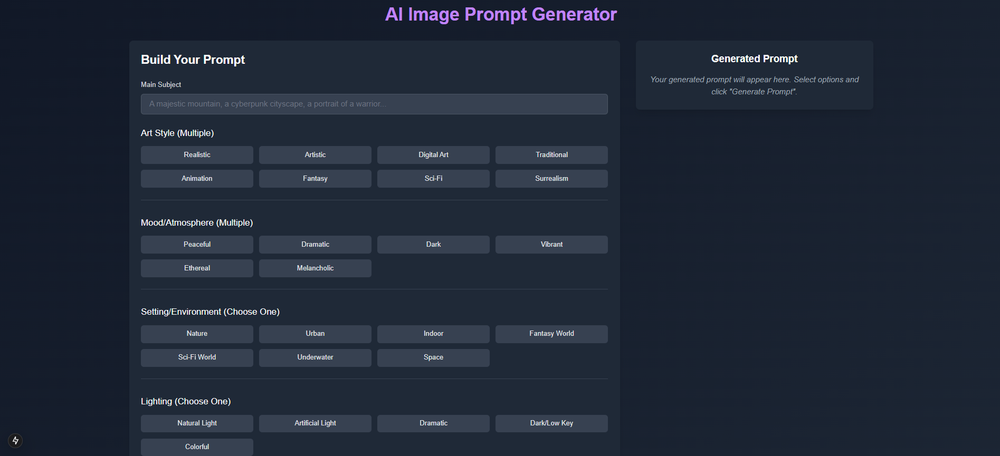

# AI Image Prompt Generator

A responsive web application that helps users create well-structured prompts for AI image generation tools such as DALL-E, Midjourney, Stable Diffusion, etc. Built with Next.js, TypeScript, and Tailwind CSS.



## Features

- **Interactive Prompt Builder**: Select from multiple categories to build comprehensive image prompts
- **Rich Option Categories**: Art styles, moods, settings, lighting, camera angles, and quality descriptors
- **Custom Detailing**: Add specific details to further enhance your prompts
- **AI-Powered Prompt Enhancement**: Leverages Hugging Face's MagicPrompt model to refine and enhance your prompts
- **Prompt History**: Access your last 10 generated prompts for quick reuse
- **Responsive Design**: Works seamlessly on mobile, tablet, and desktop devices
- **Dark Mode Support**: Automatic theme switching based on your system preferences
- **Local Storage**: Prompts are saved between browser sessions
- **One-Click Copying**: Easily copy generated prompts to paste into AI image generators

## Getting Started

### Prerequisites

- Node.js (version 14.x or higher)
- npm or Yarn package manager
- Hugging Face API key (for AI prompt enhancement)

### Installation

1. Clone the repository:
   ```bash
   git clone https://github.com/AjinND/image-prompt-generator.git
   cd image-prompt-generator
   ```

2. Install dependencies:
   ```bash
   npm install
   # or
   yarn install
   ```

3. Set up environment variables:
   Create a `.env.local` file in the root directory with:
   ```
   HUGGINGFACE_API_KEY=your_huggingface_api_key
   ```

4. Run the development server:
   ```bash
   npm run dev
   # or
   yarn dev
   ```

5. Open [http://localhost:3000](http://localhost:3000) in your browser to see the application.

## Usage Guide

### Creating a Prompt

1. **Enter a Subject**: Start by typing the main subject of your image in the "Main Subject" field.
2. **Select Options**: Choose from different categories:
   - Art Style (Realistic, Artistic, Digital Art, Animation, etc.)
   - Mood/Atmosphere (Peaceful, Dramatic, Dark, Vibrant, etc.)
   - Setting/Environment (Nature, Urban, Indoor, Fantasy World, etc.)
   - Lighting (Natural Light, Artificial Light, Dramatic, etc.)
   - Camera/Perspective (Close-up, Wide Shot, Aerial, etc.)
   - Quality Descriptors (High Quality, Professional, Trending, etc.)
3. **Add Custom Details**: Include any specific elements or attributes not covered by the preset options.
4. **Generate**: Click the "Generate Prompt" button to create your prompt. The app will use your base prompt and enhance it with AI assistance.
5. **Copy**: Use the copy button to copy the prompt to your clipboard.

### Tips for Effective Prompts

- Be specific about the subject and style you want
- Combine different categories for more detailed results
- Use the custom details field to add unique elements
- The AI enhancement will add creative elements, but start with a good foundation
- Experiment with different combinations to find what works best with your preferred AI image generator

## Project Structure

```
image-prompt-generator/
├── components/
│   ├── PromptBuilder.tsx    # Main component for building prompts
│   ├── PromptDisplay.tsx    # Component to display and copy prompts
│   └── PromptHistory.tsx    # Component for showing prompt history
├── pages/
│   ├── _app.tsx             # Next.js application wrapper
│   └── index.tsx            # Main page of the application
├── app/
│   └── api/
│       └── generate-prompt/
│           └── route.ts     # API route for AI prompt enhancement
├── public/                  # Static assets
├── styles/                  # CSS styles
├── next.config.js           # Next.js configuration
├── tailwind.config.js       # Tailwind CSS configuration
├── tsconfig.json            # TypeScript configuration
└── package.json             # Project dependencies
```

## How the AI Enhancement Works

The application uses Hugging Face's `Gustavosta/MagicPrompt-Stable-Diffusion` model to enhance your base prompts. When you click "Generate Prompt":

1. The app constructs a base prompt from your selected options
2. This base prompt is sent to the Next.js API route `/api/generate-prompt`
3. The API route calls the Hugging Face Inference API to enhance the prompt
4. The model adds creative elements while maintaining your original intent
5. If the API call fails, the application falls back to using your original base prompt

## Building for Production

```bash
npm run build
# or
yarn build
```

This will create an optimized production build in the `.next` folder.

## Deployment

This application can be deployed to various platforms:

### Vercel (Recommended)

```bash
npm install -g vercel
vercel
```

Make sure to set the `HUGGINGFACE_API_KEY` environment variable in your Vercel project settings.

### Netlify

Configure your `netlify.toml` file or deploy through the Netlify UI. Add the required environment variables in the Netlify dashboard.

### Traditional Hosting

```bash
npm run build
npm run start
```

## Customization

### Adding New Prompt Categories

Modify the `promptCategories` array in `PromptBuilder.tsx` to add new categories or options:

```typescript
const promptCategories: PromptCategory[] = [
  // Existing categories...
  {
    id: 'newCategory',
    label: 'New Category Name',
    multiSelect: true, // or false
    options: [
      { id: 'option1', label: 'Option 1', examples: ['example1', 'example2'] },
      // More options...
    ]
  }
];
```

### Modifying Prompt Structure

To change how prompts are generated, modify the `generatePrompt` function in `PromptBuilder.tsx`.

### Customizing AI Enhancement Parameters

To adjust how the AI enhances prompts, modify the parameters in the `route.ts` file:

```typescript
parameters: {
  max_length: 150, // Adjust for longer or shorter outputs
  temperature: 0.7, // Higher for more creative, lower for more predictable
  top_p: 0.9, // Controls diversity of outputs
  do_sample: true, // Enables sampling
  repetition_penalty: 1.2, // Prevents repetitive text
}
```

## Contributing

Contributions are welcome! Please feel free to submit a Pull Request.

1. Fork the repository
2. Create your feature branch (`git checkout -b feature/amazing-feature`)
3. Commit your changes (`git commit -m 'Add some amazing feature'`)
4. Push to the branch (`git push origin feature/amazing-feature`)
5. Open a Pull Request

## License

This project is licensed under the MIT License - see the LICENSE file for details.

## Acknowledgments

- Tailwind CSS for the styling framework
- Next.js team for the React framework
- Hugging Face for providing the AI models and inference API (credits: Gustavosta/MagicPrompt-Stable-Diffusion)
- AI image generation communities for prompt inspiration